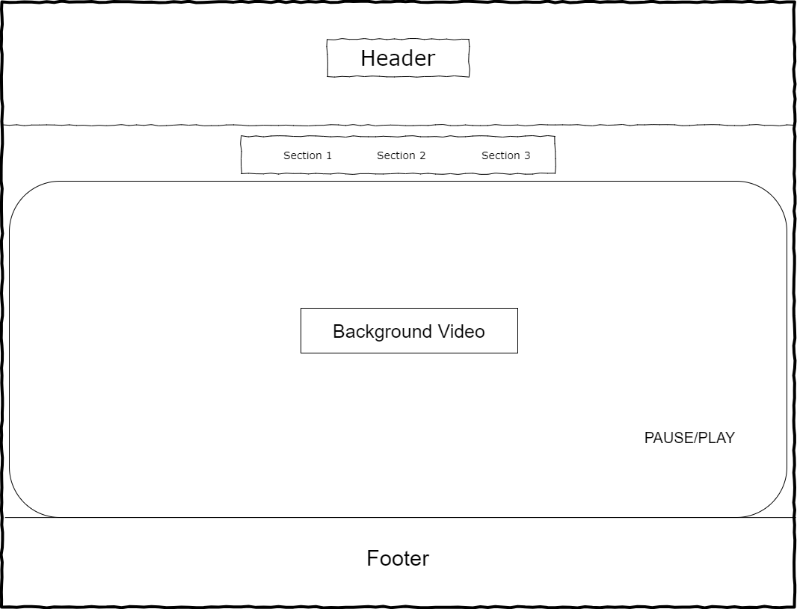
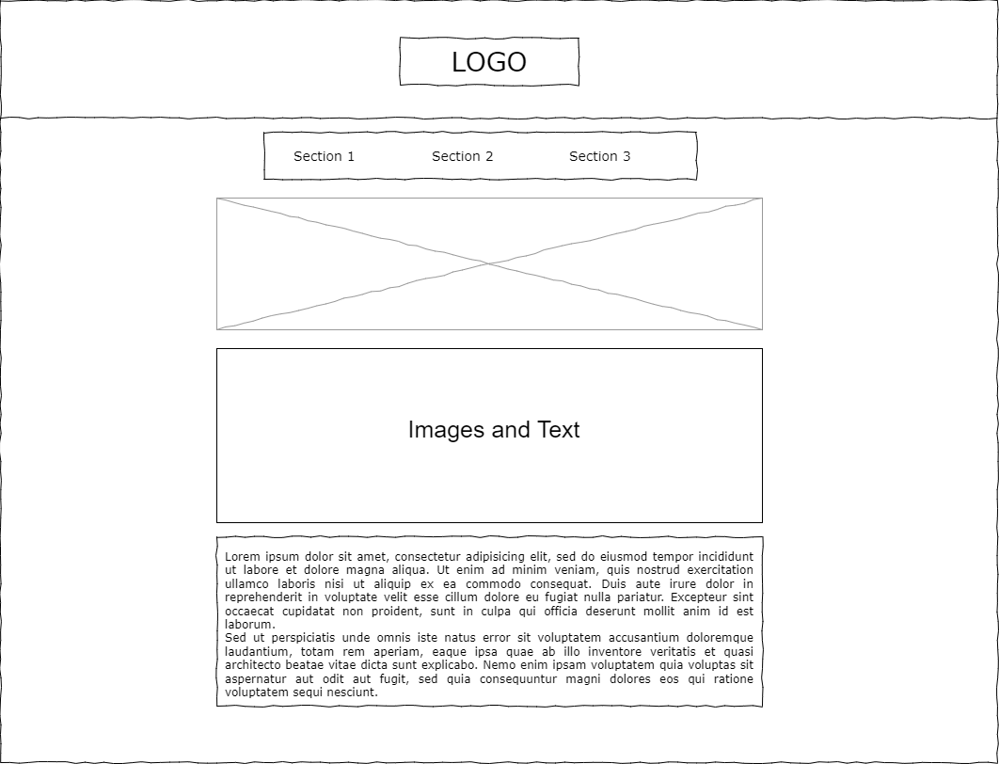
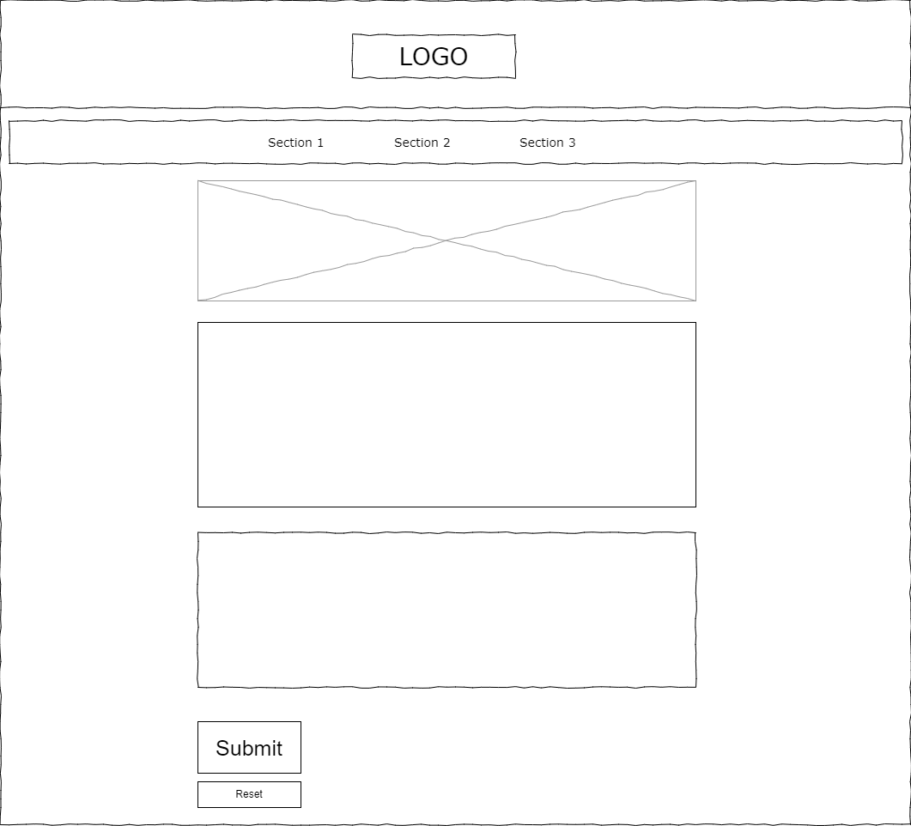
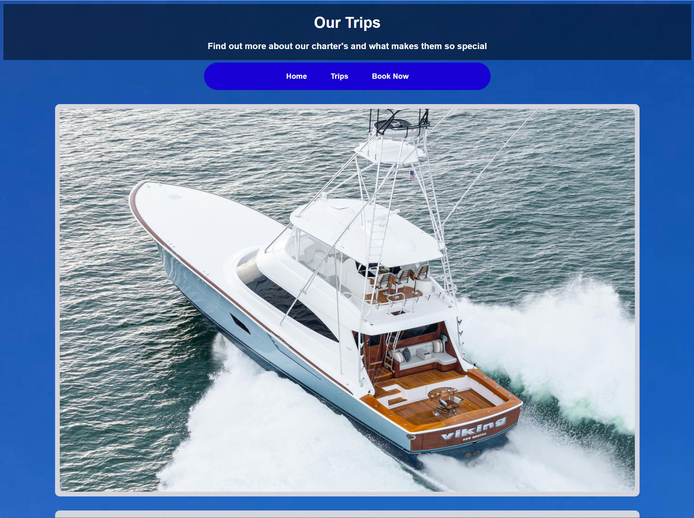
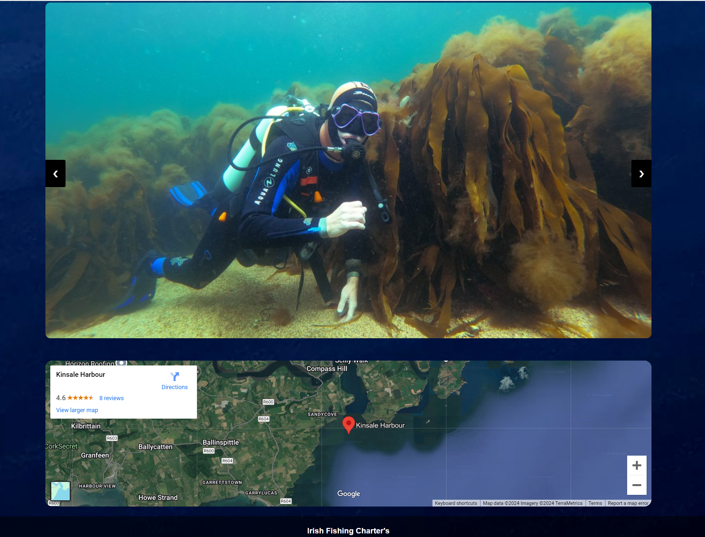
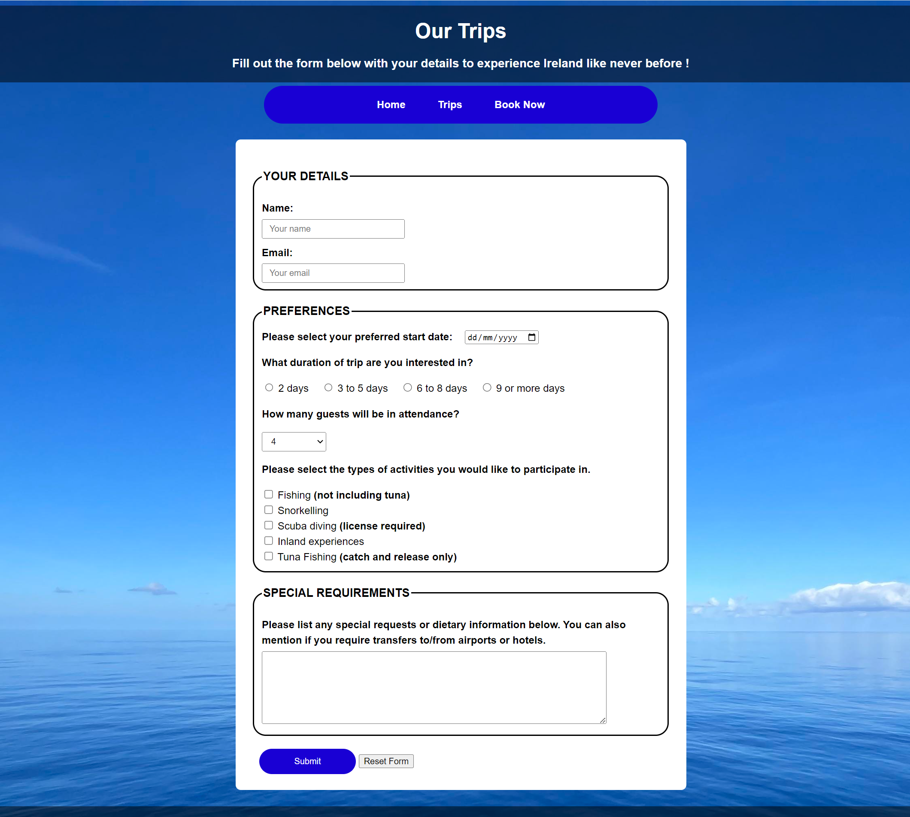
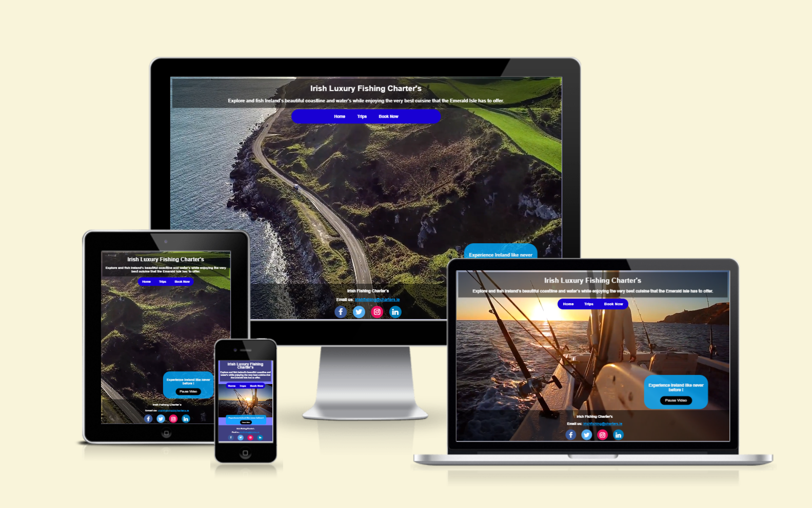
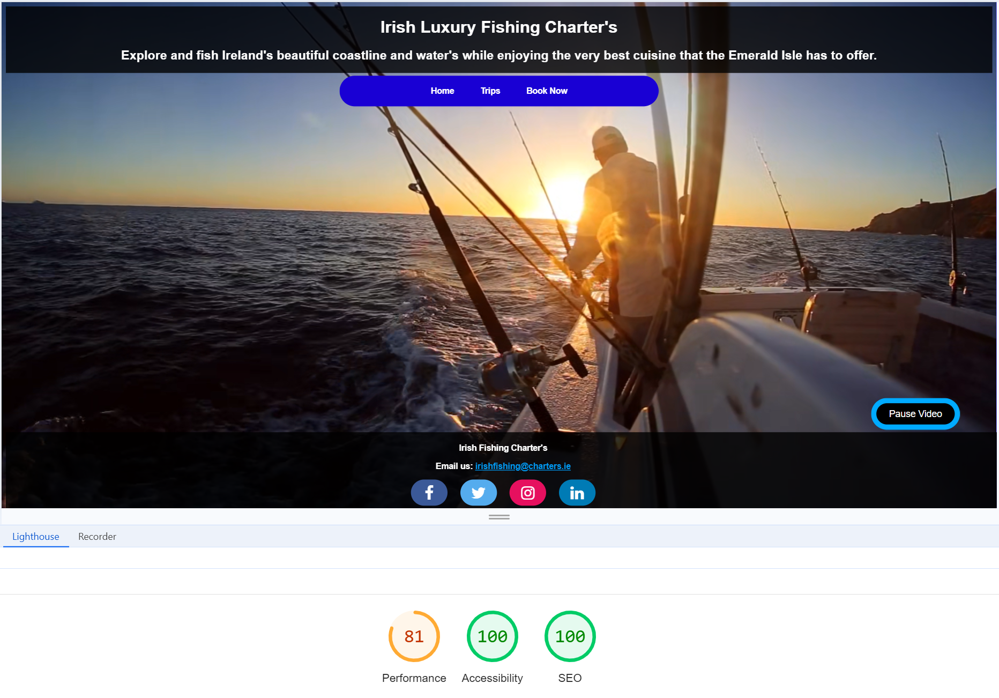
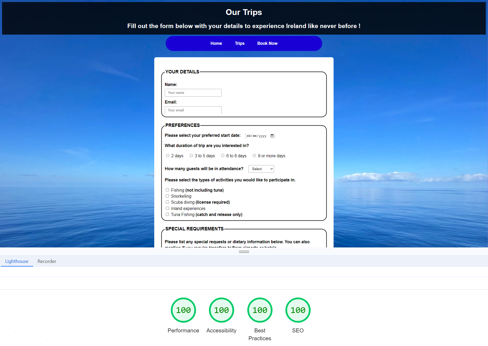
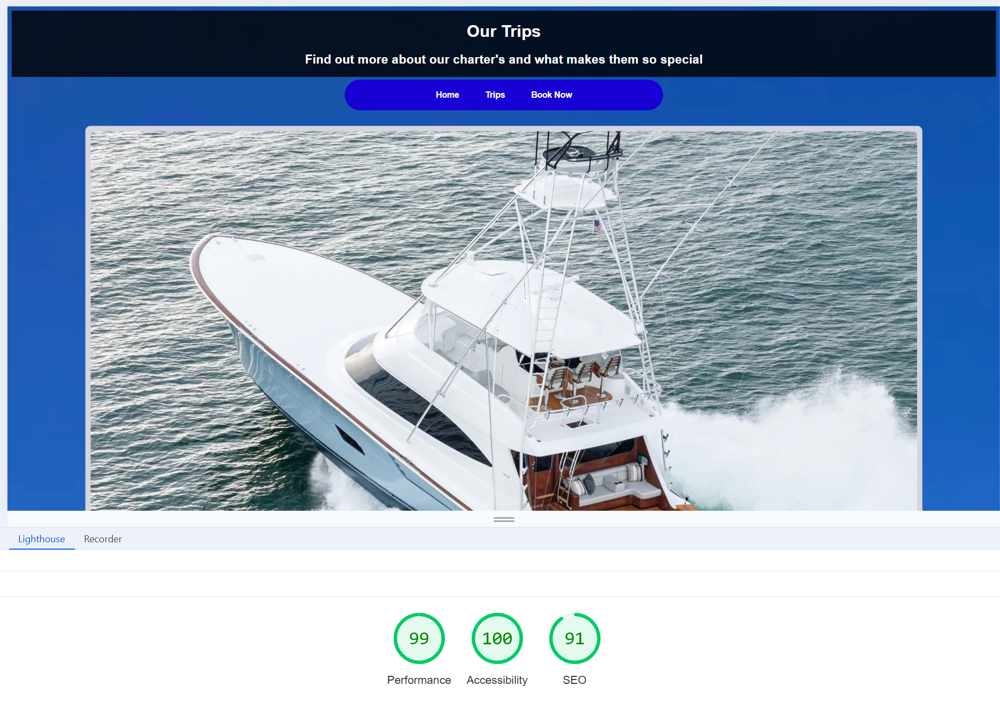

# Fishing Charter Ireland

## Introduction
Fishing Charter Ireland is a luxury fishing charter service offering tours along Ireland's beautiful coastline. This website provides information about the trips, booking options, and highlights the experience through a rich multimedia interface, including a video background and stunning visuals of Ireland.

## Table of Contents
- [Introduction](#introduction)
- [Target Audience](#target-audience)
- [Features](#features)
- [Wireframes](#wireframes)
- [Screenshots](#screenshots)
- [Responsive Design](#responsive-design)
- [Testing](#testing)
- [Installation](#installation)
- [Usage](#usage)
- [Project Structure](#project-structure)
- [Dependencies](#dependencies)
- [Credits](#credits)
- [License](#license)

## Target Audience
This project is designed for:
- **Luxury Travelers**: Individuals or groups looking for a premium fishing experience with top-tier accommodations and services.
- **Avid Anglers**: Fishing enthusiasts who want to enjoy deep-sea fishing in style aboard a luxurious sportfishing yacht with tournament-grade equipment.
- **Adventure Seekers**: Travelers who wish to explore Ireland’s rugged coastline while engaging in unique fishing adventures and cultural excursions.
- **Private Groups**: Friends, family, or corporate groups looking for a private and bespoke charter experience in Ireland.

## Features
- **Video Background**: An autoplay video of the Irish coastline that can be paused or played by the user.
- **Navigation Menu**: Links to explore different sections of the site such as Home, Trips, and Booking.
- **Booking Page**: A dedicated page for users to book their fishing trips.
- **Trips Page**: Detailed information about the boat, itinerary, and the destinations along the Irish coast.
- **Multimedia**: Integration of images and video to showcase the experience.

## Wireframes
Below are the wireframes for the key pages of the website:

### Home Page

The home page includes a video background showcasing Ireland’s coastline, a navigation menu, and a section to control the video.

### Trips Page

The trips page features detailed images and information about the fishing trips, including descriptions of the yacht and routes.

### Book Now Page

The booking page has a form for users to submit their details and preferences for the fishing charter.

## Screenshots

### Home Page

The **Home Page** welcomes users with a full-screen video background that highlights a fishing trip along Ireland's coastline. The main header, "Irish Luxury Fishing Charters," stands out, along with a description inviting users to explore and fish in Ireland's waters. Navigation buttons allow visitors to switch between the Home, Trips, and Book Now pages. A video control button is also provided at the bottom right corner to pause or play the background video.

### Trips Page

The **Trips Page** showcases the Viking Yachts 82 and describes the luxurious fishing charters offered. It also highlights the itinerary, showing stops at various iconic locations such as Kinsale, Dingle, and Galway. The images include high-quality visuals of the yacht's interior and scenic views of the journey, enhancing the luxurious and adventurous feel of the trips.

Another section of the Trips Page shows underwater activities like scuba diving, paired with a map highlighting the departure point from Kinsale Harbour. The page emphasizes the various activities and destinations that visitors will experience on their fishing adventure.

### Book Now Page

The **Book Now Page** contains a detailed form where users can submit their trip preferences, including their name, email, preferred start date, trip duration, number of guests, and activity selections such as fishing, snorkeling, or scuba diving. There is also a section for special requirements, allowing guests to request dietary accommodations or transportation assistance. This page makes it easy for users to tailor their fishing trip to their specific needs.

## Responsive Design

The website is fully responsive and adapts beautifully to different screen sizes, ensuring a seamless experience across desktops, tablets, and mobile devices.

This image demonstrates how the website looks on various devices, such as desktops, laptops, tablets, and smartphones. Regardless of the device, users can enjoy smooth navigation and access all features, including video playback, booking forms, and trip information.

## Testing

The website has undergone several manual tests to ensure that it works as intended on various devices and browsers. Below are the key areas of testing:

### 1. **Responsiveness**
- **Tested on**: Desktop, Laptop, Tablet, and Mobile devices.
- **Outcome**: The website is fully responsive and displays correctly on all screen sizes. The navigation, video playback, and form functionality work seamlessly across devices.
- **Tools Used**: Chrome Developer Tools (Device Emulation), actual device testing on Android, iOS, Windows, and macOS.

### 2. **Cross-Browser Compatibility**
- **Tested Browsers**:
  - Google Chrome
  - Mozilla Firefox
  - Microsoft Edge
  - Safari
- **Outcome**: The website works consistently across all browsers. Video autoplay, form validation, and navigation links function correctly in each tested browser.

### 3. **Form Validation**
- **Tested Areas**: 
  - Required fields (Name, Email, Start Date)
  - Email format validation
  - Dropdown selections (Number of guests)
  - Activity checkbox selections
- **Outcome**: The form validation works as expected. Users are prompted with errors if required fields are left blank or if the email format is incorrect.

### 4. **Navigation Links**
- **Tested Links**: Home, Trips, Book Now
- **Outcome**: All navigation links work as expected and direct users to the correct pages. The navigation bar remains functional across different screen sizes.

### 5. **Video Playback**
- **Tested Functionality**: 
  - Autoplay of background video on the home page
  - Pause/Play button functionality
- **Outcome**: The video autoplays upon page load, and the Pause/Play button works as intended. The video controls remain functional across devices and browsers.

### 6. **Performance Testing**
The website’s performance was tested using **Lighthouse** to evaluate its **Performance**, **Accessibility**, **Best Practices**, and **SEO**. Below are the test results for different pages:

#### **Home Page**
- **Performance**: 81
- **Accessibility**: 100
- **SEO**: 100

#### **Book Now Page**
- **Performance**: 100
- **Accessibility**: 100
- **Best Practices**: 100
- **SEO**: 100

#### **Trips Page**
- **Performance**: 99
- **Accessibility**: 100
- **SEO**: 91

These tests indicate that the website is highly optimized across all metrics, with excellent scores for **Accessibility**, **SEO**, and **Best Practices**.

## Installation
This project is static, and you can run it locally by following these steps:
1. Download or clone the project repository.
2. Ensure the file structure remains intact (e.g., keep the assets folder and HTML files in the same hierarchy).
3. Open `home.html` in any web browser to view the site.

## Usage
- **Home Page**: The main landing page of the website featuring a video background and navigation links.
- **Trips Page**: Provides detailed information about the luxury yacht, the routes, and stops at various harbors.
- **Book Now**: A form for users to submit their booking details, including name, email, preferred start date, and trip duration.

## Project Structure
The project has the following structure: Project-1-home/ ├── Project-1-home.html/ │ ├── assets/ │ │ ├── media/ # Images and videos used on the site │ │ └── styles/ # CSS stylesheet │ ├── book-now.html # Booking page │ ├── home.html # Main homepage │ └── trips.html # Trips information page

## Dependencies
- **Font Awesome**: Used for social media icons in the footer.
- **CSS**: Custom styles are included in `assets/styles/styles.css`.
- **JavaScript**: Embedded within the HTML to control video playback.

## Credits
This project was made possible with the help of various resources for learning HTML and CSS, as well as assistance from ChatGPT:
- **[W3Schools](https://www.w3schools.com/)**: Comprehensive tutorials on HTML and CSS.
- **[MDN Web Docs](https://developer.mozilla.org/)**: Excellent documentation for web development standards and best practices.
- **[CSS-Tricks](https://css-tricks.com/)**: Guides and tips for mastering CSS design and layouts.
- **[HTML Dog](https://htmldog.com/)**: A great resource for tutorials on HTML and CSS fundamentals.
- **ChatGPT**: Provided guidance on structure and assistance with gathering data for content.

## License
This project is licensed under the MIT License. See the `LICENSE` file for more information.
